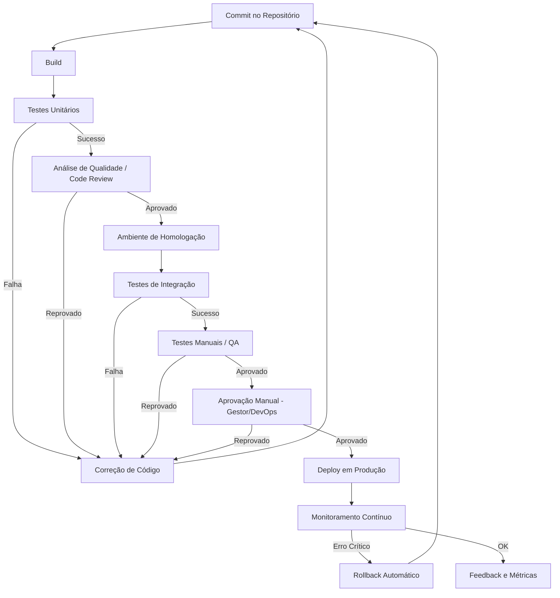

# FLUXOGRAMA - DevOps

**Nome:** Bruno Portugal & Maria Werlang  
**Data:** 28/08/2025  
**Disciplina:** DevOps 

---

# 1. INTRODUÇÃO

O presente documento descreve detalhadamente o pipeline de implementação de software, desde o envio do código para o repositório até o monitoramento em produção. O objetivo é garantir **entregas contínuas, seguras e de qualidade**, integrando automação com pontos de controle manual.

---

# 2. DESCRIÇÃO DAS ETAPAS DO PIPELINE

## 2.1 Commit no Repositório
O desenvolvedor realiza o envio (push) das alterações de código para o repositório Git. Esse evento dispara automaticamente o pipeline de integração contínua (CI/CD).  
**Objetivo:** centralizar as mudanças e iniciar o processo de build e testes.  
**Exemplo:** Um desenvolvedor corrige um bug em um método de cálculo de preço e envia a alteração para o branch `main` do GitHub.

---

## 2.2 Build
O código é compilado e empacotado em artefatos executáveis, containers ou pacotes, resolvendo todas as dependências necessárias.  
**Ferramentas comuns:** Maven, Gradle, NPM, Docker.  
**Objetivo:** gerar uma versão do código que possa ser testada e implantada.  
**Exemplo:** Um projeto Java é compilado com Maven e gera um arquivo `jar` pronto para teste.

---

## 2.3 Testes Unitários
Testes automatizados verificam a funcionalidade de métodos e funções individualmente.  
**Ferramentas comuns:** JUnit (Java), PyTest (Python), Jest (JavaScript).  
**Objetivo:** assegurar que cada componente básico do sistema funciona corretamente.  
**Exemplo:** Um teste verifica se a função de soma retorna o valor correto para entradas específicas.

---

## 2.4 Análise de Qualidade / Code Review
O código é avaliado por ferramentas de análise estática e revisado por pares por meio de pull requests.  
**Ferramentas comuns:** SonarQube, ESLint, Checkstyle.  
**Objetivo:** manter padrões de qualidade, detectar vulnerabilidades e prevenir más práticas de programação.  
**Exemplo:** Um pull request é criado e outro desenvolvedor revisa o código, garantindo que não haja vulnerabilidades de segurança.

---

## 2.5 Ambiente de Homologação
O sistema é implantado em ambiente de teste controlado, similar ao ambiente de produção, utilizando dados fictícios ou mascarados.  
**Objetivo:** permitir testes em condições próximas à realidade sem afetar os usuários finais.  
**Exemplo:** O sistema é implantado em um servidor de teste com dados de clientes fictícios para validação.

---

## 2.6 Testes de Integração
Verificam o funcionamento conjunto dos módulos do sistema e a integração com bancos de dados, APIs ou outros serviços.  
**Objetivo:** identificar falhas de compatibilidade e comunicação entre componentes.  
**Exemplo:** Um teste garante que a API de pagamento se comunica corretamente com o módulo de pedidos.

---

## 2.7 Testes Manuais / QA
A equipe de Qualidade realiza testes manuais exploratórios, de usabilidade e aceitação pelo negócio.  
**Objetivo:** validar a experiência do usuário e identificar problemas não capturados por testes automatizados.  
**Exemplo:** Um testador verifica se o formulário de cadastro é intuitivo e funciona corretamente em diferentes navegadores.

---

## 2.8 Aprovação Manual – Gestor/DevOps
Dependendo da criticidade da entrega, a liberação para produção requer aprovação manual de um gestor ou engenheiro de DevOps.  
**Objetivo:** assegurar controle e segurança antes de liberar a versão em produção.  
**Exemplo:** O gerente revisa os resultados dos testes e aprova a implantação da nova versão.

---

## 2.9 Deploy em Produção
O sistema é implantado no ambiente de produção, utilizando estratégias como blue-green deployment, canary release ou rolling update.  
**Objetivo:** disponibilizar a nova versão do sistema para os usuários finais.  
**Exemplo:** A versão 2.1 da aplicação web é liberada para todos os usuários utilizando um deploy canário para monitoramento inicial.

---

## 2.10 Monitoramento Contínuo
São coletadas métricas, logs e informações de desempenho em tempo real.  
**Ferramentas comuns:** Prometheus, Grafana, ELK, Datadog.  
**Objetivo:** detectar falhas e monitorar a performance do sistema após o deploy.  
**Exemplo:** O Grafana alerta a equipe quando o tempo de resposta da API ultrapassa 2 segundos.

---

## 2.11 Rollback Automático
Em caso de detecção de erros críticos, o sistema retorna automaticamente à versão anterior.  
**Objetivo:** minimizar impactos negativos e garantir a disponibilidade do serviço.  
**Exemplo:** Um bug crítico é detectado no deploy; a ferramenta de CI/CD reverte automaticamente para a versão estável anterior.

---

## 2.12 Feedback e Métricas
Os dados de monitoramento e resultados de testes são analisados, incluindo taxa de falhas, tempo médio de entrega e indicadores de desempenho.  
**Objetivo:** permitir a melhoria contínua do processo de desenvolvimento e entrega.  
**Exemplo:** O time avalia que a nova versão diminuiu em 20% os erros de cadastro de clientes e planeja ajustes futuros.

---

# 3. CONCLUSÃO

O pipeline descrito integra práticas de **Integração Contínua (CI)** e **Entrega Contínua (CD)**, combinando automação com revisões e aprovações humanas. Dessa forma, assegura entregas mais rápidas, confiáveis e auditáveis, alinhadas a padrões de qualidade e segurança.
