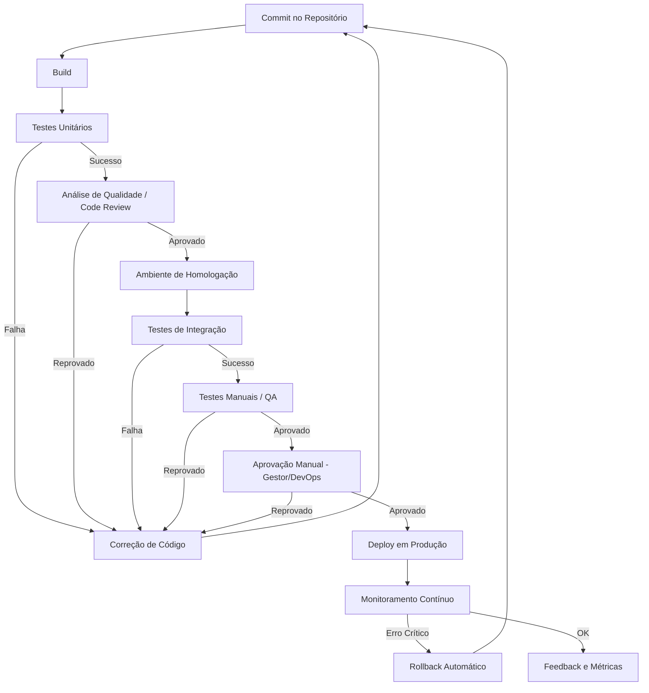

```mermaid
flowchart TD
    A[Commit no Repositório] --> B[Build]
    B --> C[Testes Unitários]
    
    C -->|Sucesso| D[Análise de Qualidade / Code Review]
    C -->|Falha| X[Correção de Código]
    X --> A

    D -->|Aprovado| E[Ambiente de Homologação]
    D -->|Reprovado| X

    E --> F[Testes de Integração]
    F -->|Sucesso| G[Testes Manuais / QA]
    F -->|Falha| X

    G -->|Aprovado| H["Aprovação Manual - Gestor/DevOps"]
    G -->|Reprovado| X

    H -->|Aprovado| I[Deploy em Produção]
    H -->|Reprovado| X

    I --> J[Monitoramento Contínuo]
    J -->|Erro Crítico| K[Rollback Automático]
    J -->|OK| L[Feedback e Métricas]
    
    K --> A
```
